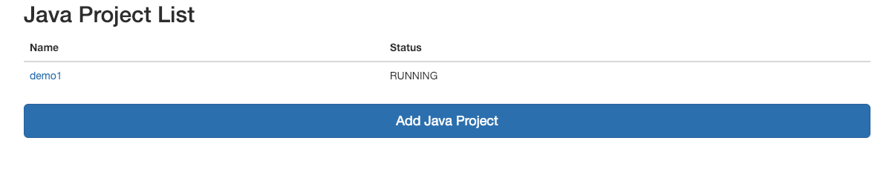
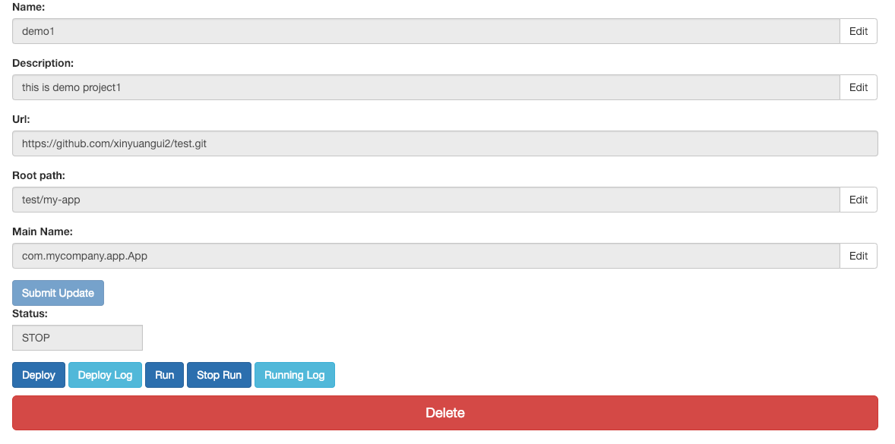

# Deploy System

This is the first version for Deploy System based on Spring Boot and linux shell. User only need to input git address to deploy java project.

## Deploy

### Dependencies

Linux, Java, Maven, Mysql

### Create and configure database

* Run the sql script in `sql/init_database.sql`
* Configure the database url, username and password in `src/main/resources/applications.properties`

### Shell script

* This deployment platform is based on shell script. The script is stored in `shell`

### Run

* Run `mvn clean install` to build project.
* Run `java -jar target/deploySystem-0.0.1-SNAPSHOT.jar` to run this project on port 8080 (you can configure port `src/main/resources/applications.properties`)

## Java Project

* User can use this website to deploy maven based java project.
* Use websocket to get the current status of projects and update it on the list page.
* In the java-project-detail page, the status is gotten through the API call every 5 seconds. The deploy log and running log is gotten through websocket (dynamically).

### Deploy

* User inputs the name and description for this project
* Url is the git address (currently on support public repository)
* Root path will lead to the location of `pom.xml`
* Main Name is the full class name of the Main class

## Future Plan

Web Deployment Function