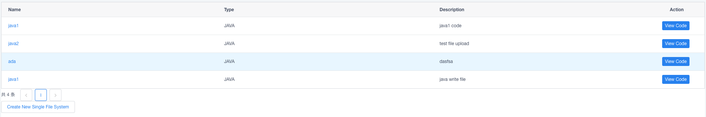
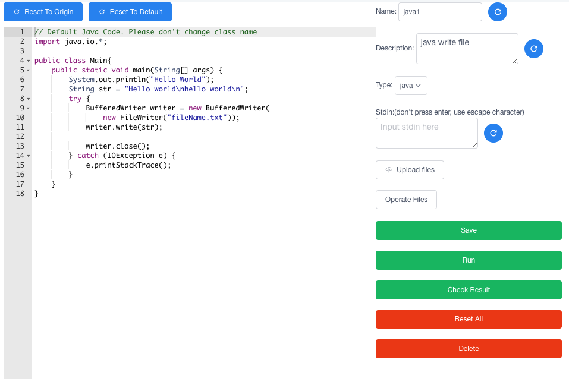

# Deploy System2

This project is based on Spring Boot, Vuejs, Docker, Flask, Redis-RQ. Can be dividec into two parts: spring-boot-vuejs and executor.

## Spring-boot-vuejs

* Use **vuejs** as frontend part and **spring boot** as backend part.
* in dev mode, vuejs and spring boot will run on two different ports. Vuejs server will send request to spring boot server.
* In build mode, webpack will generate static files. And spring boot will use these static files to respond to requests.

## Executor

* One **Flask** server will get the request from spring boot server. Once it receives the request, it will send job to **rq**. Rq will build the docker container and run the code.

## Support Functions

Currently support single-file-code. Later will support web project deployment.

### Single File Code

* User can run java, cpp and python code directly. Except for the stdin and stdout, also support file write. User can upload file to read and download the result file.

## How To Run

### Executor Server

* Go to the `docker` folder. Build the docker image by command `docker build -t alpine_single_file .`
* Configure the port, docker image name, code path in `config.py`
* Run redis-server by `redis-server`
* Run script `set_up.sh`. This script will set up the flask server and two rq workers.

### Spring-boot-vuejs

#### Dev Mode

* Initialize database by running `sql/init.sql`. Configure database in `backend/src/main/resources/application.properties`
* Go to `switch-dev-build`, run `switch_to_dev.sh` script
* Set up backend server by running `mvn clean install && java -jar backend/target/backend-0.0.1-SNAPSHOT.jar` in `spring-boot-vuejs` folder.
* Set up frontend server by running `npm run serve` in `frontend` server.

#### Build Mode

* Initialize database by running `sql/init.sql`. Configure database in `backend/src/main/resources/application.properties`
* Go to `switch-dev-build`, run `switch_to_build.sh` script
* Set up server by running `mvn clean install && java -jar backend/target/backend-0.0.1-SNAPSHOT.jar` in `spring-boot-vuejs` folder.
